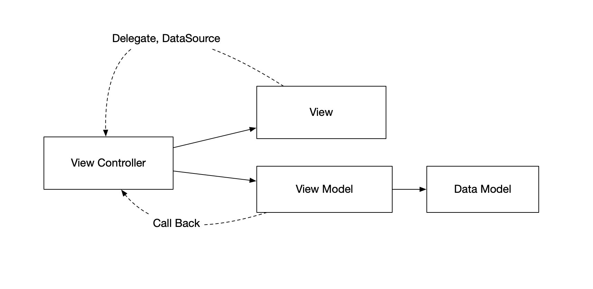
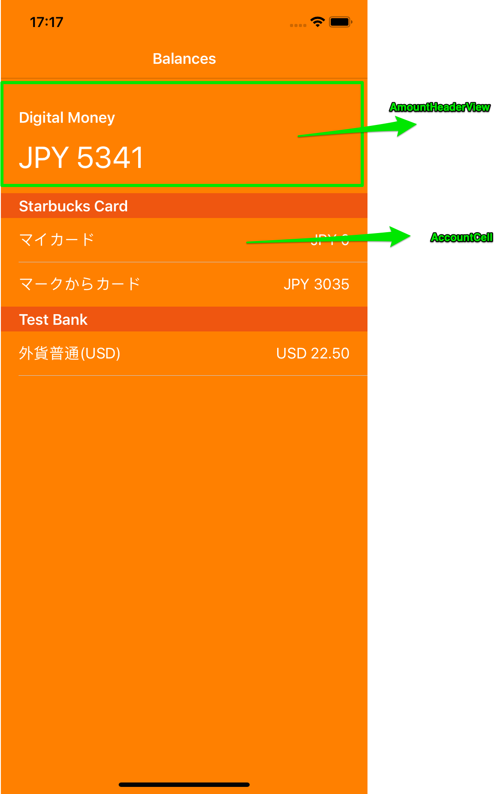
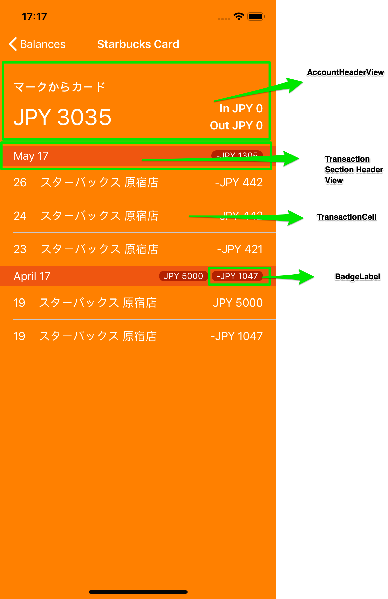

#  MoneyTree Code Challenage
This is a demo project for MoneyTree code Challenage

## Requirements
- Xcode Version 10.3 or above
- MacOS 10.14 or above

## To run the app
1. Clone or download the source code
2. open it with Xcode 10.3 or above
3. change the Development Team to you own one
4. build and run it

## Tasks completed
- Data Task
- User Stories 1, 2, 3, 4
- Accessibility Support
- Testings: UI Tests, Unit Tests
- No warnings ( )
- REAMME file and documentations are created

## Accessibility Support
Added extra string to describe the value of the label by using "accessibilityValue", to help Voice Over to descript the label in more content.

Added "accessibilityHint" to guide user to double tap the cell

Relace "accessibilityLabel" value for table cells to describe more detail of a cell

## Unit Tests
### All tests are base on the json files provided, any change of json file data will fail all the tests
The development are base on TDD by using nano-cycles, and micro-cycles. 
Both Unit Test targets have the "Randomize execution order" option on, this will make sure all unit tests are independ on its own and will no require tests to execute in linear order. 

There are two Unit Tests targets.
- "MTCodeChallengeTests" that rquires the MTCodeChallenge app as host. Which it is for testing the app
- "LogicTests" is a host-less testing target. As it doesn't requires the host app, it is good for test the logics, and it making sure the testing logic in not depend on the app or other objects. Also this make TDD development faster.

## UI Tests
There is one UI test target MTCodeChallengeUITests. It is for testing UI exstence and also test the navigations between views. 

## Assumptions and Limitations 
- the currency string is harcoded to use "jp_JP" locale for currency format
- Currency string is not displaying with the "comma" in the simulator device, looks like a system bug 
- Localization is not supported in this demo

## Something to consider for real life app
* Implement SwiftLint ( https://github.com/realm/SwiftLint ) to enforce Swift style and conventions.
* Use FastLane ( https://fastlane.tools ) for continually integration
* Use AppCenter ( https://appcenter.ms ) for storing build and collecting crashes

## App structure
### deside patten
The app is base on MVVM design patten. see attchment below for overview.

AppOveview: 

Home page custom views

Account detail page custom views

